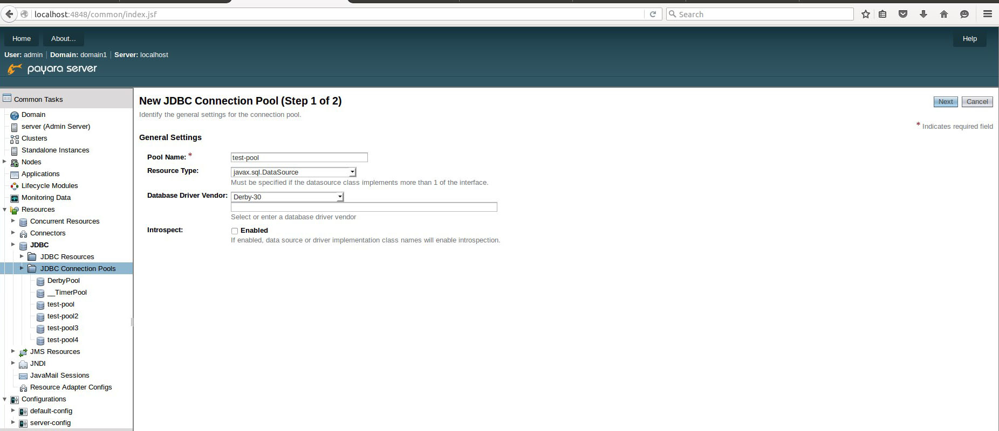

# Configure a connection pool

## What is a connection pool?

Database connections are expensive to create and also to maintain. A connection pool is a store of database connections that can be used and (most importantly) re-used to connect to a database. They improve both the performance and scalability of the system.

Rather than creating a new connection each time one is needed a pool of connections is created when Payara server is started. When a new connection is required the pool is searched for an available connection. If one is available it is returned to the requester. If none is available then the request is either queued or a new connection is established depending on how many connections are already in the pool and how the pool is configured. Once the connection is finished with, rather than closing it the connection is returned to the connection pool for use by the next requester.

## Creating the connection pool

### Using Admin Console

In the left hand panel of the Admin console go to `Resources` -> `JDBC` -> `JDBC Connection Pools`

Click `New` and enter the following values:

| Setting Name   | Value        |
|----------------|--------------|
| Pool Name      | test-pool    |
| Resource Type  | javax.sql.DataSource |
| Driver Vendor  | (value for the driver, e.g. Derby30 for a Derby DB, MySQL for a MySQL DB ) |

Click Next and then click Finish on the next screen, accepting the default values.



Add the following properties to the connection pool by going to the additional properties tab of the connection pool.

| Setting name | Value                 | Description   |
|--------------|-----------------------|---------------|
| PortNumber   | 3306                  | Database port |
| Password     | mypassword            | Database password |
| User         | root                  | Database user |
| serverName   | localhost             | Database address |
| DatabaseName | test                  | Name of the database |
| connectionAttributes |   | Other connection attributes (supported by the JDBC driver) |


To test the connection attributes, go back to the General tab and click the Ping button at the top of the screen. You should see a message stating Ping Succeeded.

### Using asadmin

You can also create a connection pool using the asadmin command line tool with the following :

```bash
asadmin create-jdbc-connection-pool --datasourceclassname com.mysql.jdbc.jdbc2.optional.MysqlDataSource --restype javax.sql.DataSource --property user=root:password=test:DatabaseName=test:ServerName=localhost:port=3306 test-pool
```

With this command, you need to specify the full name of the driver's class instead of just selecting a value from a drop-down menu.

To test the connection from the command line run the following command:

```bash
asadmin ping-connection-pool test-pool
```
