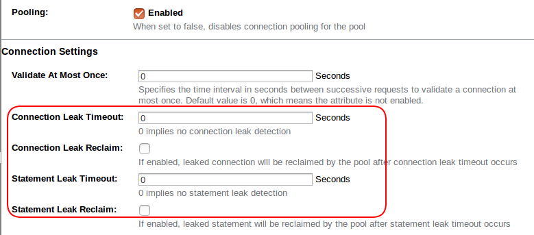

# Statement and Connection Leak Detection

Statement and Connection Leak Detection allows you to set time-outs so that if Statements or Connections haven't been closed by an application they can be logged and/or closed.

By default these values are set to 0 meaning detection is turned off.

In testing, it is recommended that leaks are logged after a short timeout but not closed.
In production, it is recommended that leaks are closed and all logged leaks are monitored.

## Setting Leak Detection via the admin console

1. Click on the name of the pool
2. Select the advanced tab
3. Scroll down to Connection Settings
4. Set the Connection Leak Timeout and Statement Leak Timeout value in seconds



## Setting Leak Detection via asadmin

You can set the time-out values with the following commands:

```bash
asadmin> set resources.jdbc-connection-pool.test-pool.statement-leak-timeout-in-seconds=5
```

```bash
asadmin> set resources.jdbc-connection-pool.test-pool.connection-leak-timeout-in-seconds=5
```

You can turn on reclaiming of the leaking resources with the following commands:

```bash
asadmin> set resources.jdbc-connection-pool.DerbyPool.connection-leak-reclaim=true
```

```bash
asadmin> setresources.jdbc-connection-pool.DerbyPool.statement-leak-reclaim=true
```

Once these values are set if connection or statement leaks are detected you will see messages similar to the ones below in the application log.

```
WARNING: A potential connection leak detected for connection pool test-pool. The stack trace of the thread is provided below:

WARNING: A potential statement leak detected for connection pool test-pool. The stack trace of the thread is provided below:
```
